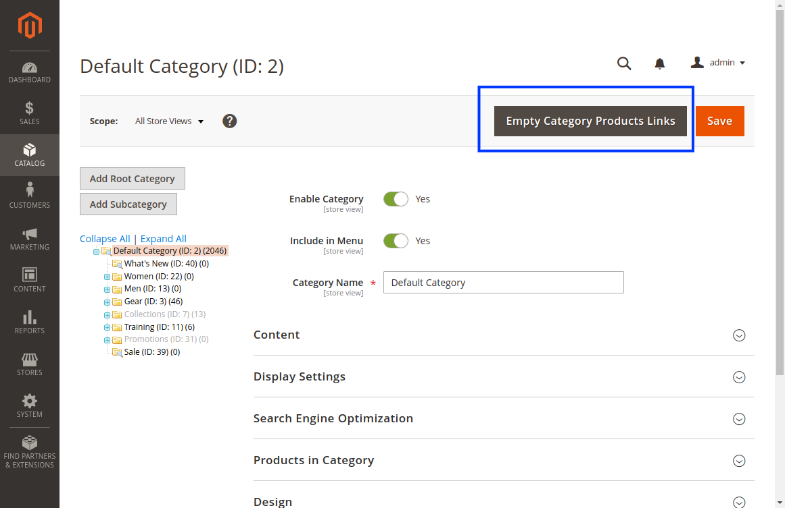

# Category Empty Button

[](https://packagist.org/packages/blackbird/quick-category-save)
[](./LICENSE)

This module allows you to remove all the products from a category with a simple button.
The free source is available at the [GitHub repository](https://github.com/blackbird-agency/magento-2-category-empty-button).



## Setup

### Get the package

**Zip Package:**

Unzip the package in app/code/Blackbird/CategoryEmptyButton, from the root of your Magento instance.

**Composer Package:**

```
composer require blackbird/category-empty-button
```

### Install the module

Go to your Magento root, then run the following Magento command:

```
php bin/magento setup:upgrade
```

**If you are in production mode, do not forget to recompile and redeploy the static resources, or to use the `--keep-generated` option.**

## Support

- If you have any issue with this code, feel free to [open an issue](https://github.com/blackbird-agency/magento-2-category-empty-button/issues/new).
- If you want to contribute to this project, feel free to [create a pull request](https://github.com/blackbird-agency/magento-2-category-empty-button/compare).

## Contact

For further information, contact us:

- by email: hello@bird.eu
- or by form: [https://black.bird.eu/en/contacts/](https://black.bird.eu/contacts/)

## Authors

- **Bruno Fache** - *Maintainer* - [It's me!](https://github.com/bruno-blackbird)
- **Blackbird Team** - *Contributor* - [They're awesome!](https://github.com/blackbird-agency)

## License

This project is licensed under the MIT License - see the [LICENSE](LICENSE) file for details.

***That's all folks!***

